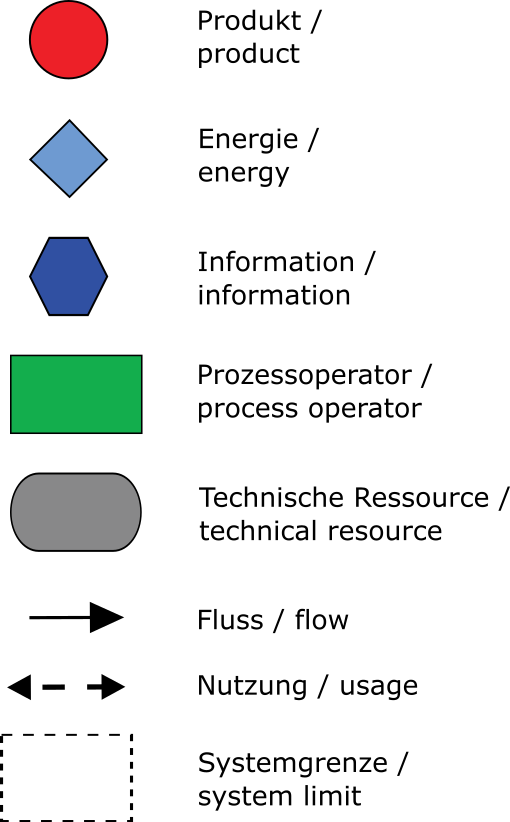
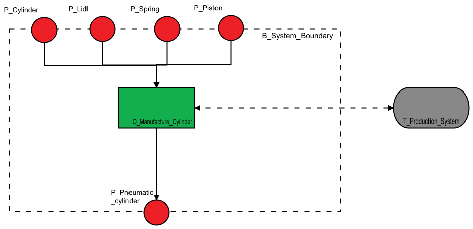
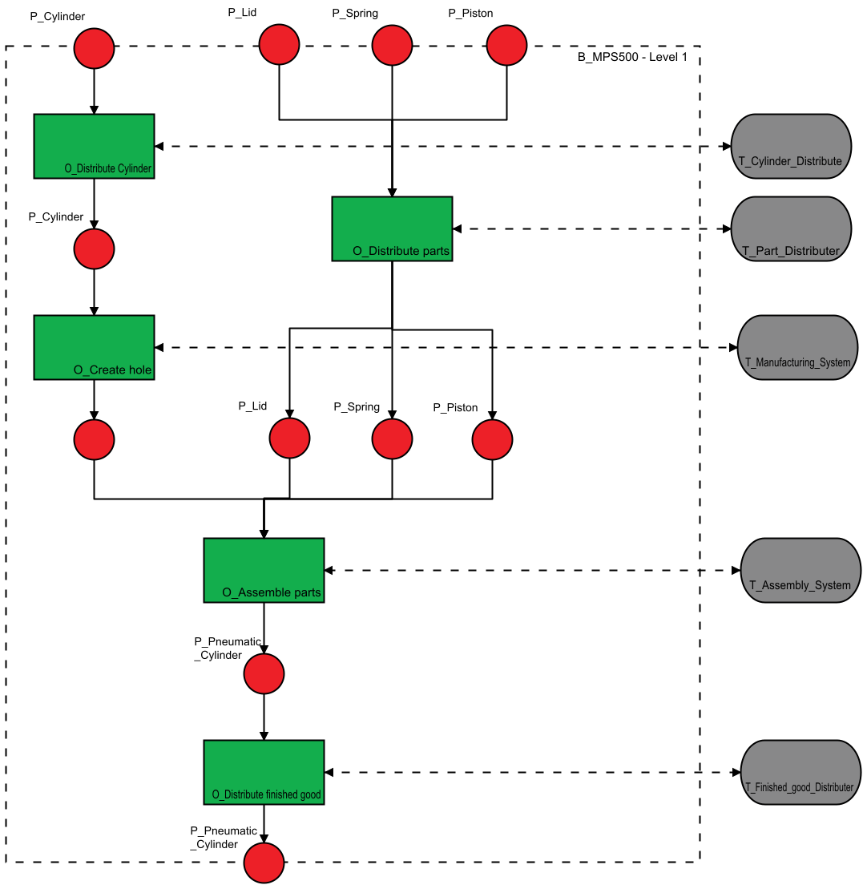
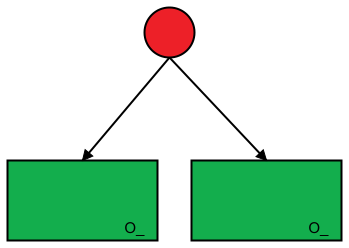
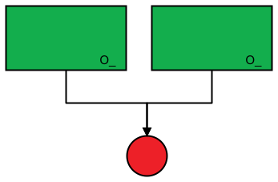
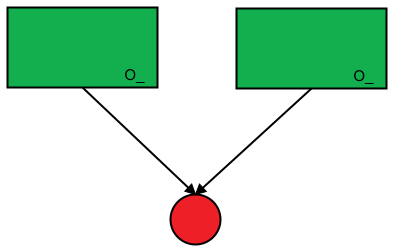
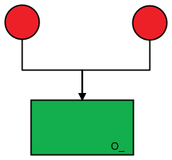
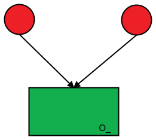
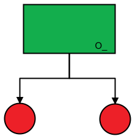
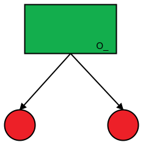

# FPB.JS

Offenes, webbasiertes Werkzeug für die Formalisierte Prozessbeschreibung nach VDI 3682.

[VDI 3682](#vdi-3682---formalisierte-prozessbeschreibungen) | [Inbetriebnahme](#inbetriebnahme-von-fpbjs) | [Wiki](https://github.com/HamiedNabizada/FPB.JS/wiki) | [Demo](http://demo.fpbjs.net/)

## VDI 3682 - Formalisierte Prozessbeschreibungen

Die Richtlinie stellt ein Vorgehensmodell vor, mit dessen Hilfe Prozesse universell grafisch beschrieben und informationstechnisch erfasst werden können. Während aller Phasen (Planung, Realisierung, Inbetriebsetzung, Wartung, etc.) des Engineerings wird dadurch ein eindeutiges, gewerkeübergreifendes Prozessverständnis erreicht.
Im ersten Teil der Richtlinie wird eine einfache Symbolik, sowie zulässige Beziehungen zwischen diesen eingeführt. 
 
| | 
|:--:|
| *Symbole der grafischen Prozessbeschreibung* |

Zustandsbeschreibende Symbole (Produkt, Information, Energie) sind dabei mittels gerichteter Kanten (Flüssen) mit Prozessoperatoren verbunden, die einen Zustand ante in einen Zustand post überführen. Die Zustandsumwandlung geschieht dabei durch die Verwendung von technischen Ressourcen. In der grafischen Notation ist diese Beziehung durch einen gestrichelten Doppelpfeil (Nutzung) dargestellt. Ein gestrichelter Rahmen definiert die Systemgrenze des dargstellten Prozesses. 

|  |
|:--:|
| *Beispielprozess: Herstellung eines Pneumatik-Zylinders ( aus [1] )* | 

Durch Dekomposition der Prozessoperatoren lassen sich detailliertere Beschreibungen der Prozessschritte ableiten und der gesamte Prozess strukturieren:

|  |
|:--:|
| *Dekomponierte Proessansicht des Prozessoperators.( aus [1] )* | 

Die Darstellung von alternativen und parallelen Prozessabläufen wird von der Richtlinie wie folgt vorgesehen:

| Parallel   |      Alternativ      |  Beschreibung |
|:----------:|:-------------:|------|
|  |  | Parallele / Alternative Prozessschritte mit einem zugeführten Produkt |
| |  | Parallele / Alternative Prozessschritte mit einem entstehenden Produkt |
|  |  | Parallel / Alternativ zugeführte Produkte in einen Prozessschritt |
|   |  | Parallel / Alternativ entsehende Produkte aus einem Prozessschritt | 

## Inbetriebnahme von FPB.JS
Es gibt zwei Varianten, wie man FPB.JS in Betrieb nehmen kann. Es kann lokal auf dem Rechner oder innerhalb eines Container installiert werden. Beide Varianten werden im Folgenden beschrieben.

### Voraussetzungen für die lokale Installation
Für die Inbetriebnahme von FPB.JS im Development Mode wird
[Node.JS](https://nodejs.org/en/) benötigt. Außerdem empfiehlt es sich, eine IDE wie [Visual Studio Code](https://code.visualstudio.com/) für das Ausführen der Commands zum Installieren / Starten von FPB.JS im Development Mode zu verwenden. Dies ist jedoch nicht zwingend notwendig und geht in gleicher Weise auch über die Eingabeaufforderung Ihres Betriebssystems.

### Vorgehen zur lokalen Installation
1) Clonen oder [Downloaden](https://github.com/HamiedNabizada/FPB.JS/archive/master.zip) Sie sich dieses Repository. Wenn Sie sich das Repository heruntergeladen haben, dann müssen Sie die zip-komprimierte Datei auf Ihrem lokalen Speicher entpacken.  
2) Navigieren Sie entweder in der Eingabeaufforderung Ihres Betriebssystems oder im Terminal Ihrer IDE zum Stammordner der FPB.JS Kopie.
3) Führen Sie zur Installation den Command:

   `npm install`
   
   aus, dies installiert alle softwareseitigen Abhängigkeiten von FPB.JS: 
4) Zum Starten führen Sie im Terminal den Command:

   `npm run dev`  
   
   aus. Durch das Aufrufen von 
   
   `localhost:8080` 
   
   in Ihrem Webbrowser haben Sie Zugriff auf die Benutzeroberfläche von FPB.JS.

### Voraussetzungen für die Erstellung eines Container Image
Zur Erstellung des Container Image und zum Betrieb des Containers wird Docker benötigt. 

### Erstellung eines Container Image

Navigieren Sie entweder in der Eingabeaufforderung Ihres Betriebssystems oder im Terminal Ihrer IDE zum Stammordner der FPB.JS Kopie. Erstellen die ein Container Image mit:

 `docker build  -t fpb_js:0.0.1 .`

Anschließend kann der Container mit 

 `docker run -p 8080:8080 fpb_js:0.0.1`

gestartet werden. Durch das Aufrufen von 
   
   `0.0.0.0:8080` 
   
in Ihrem Webbrowser haben Sie Zugriff auf die Benutzeroberfläche von FPB.JS.

## Nutzung von FPB.JS
Wie Sie FPB.JS nutzen können, wird im Wiki dieses GitHub Repositories erläutert:
[Wiki](https://github.com/HamiedNabizada/FPB.JS/wiki)

## License
[MIT](https://raw.githubusercontent.com/HamiedNabizada/FPB.JS/master/LICENSE)

## Literatur
[1] Fay, A., Hoang, X. L., Diedrich, C., Dubovy, M., Eck, C., Hildebrandt, C., Scholz, A., Schröder, T. u. Wiegand, R.: Abschlussbericht – SemAnz40. Vorhandene Standards als semantische Basis für die Anwendung von Industrie 4.0. Hamburg: Helmut-Schmidt-Universität / Universität der Bundeswehr Hamburg 2018
