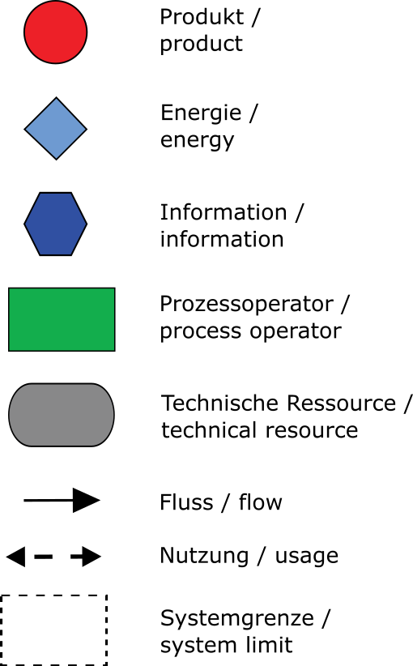
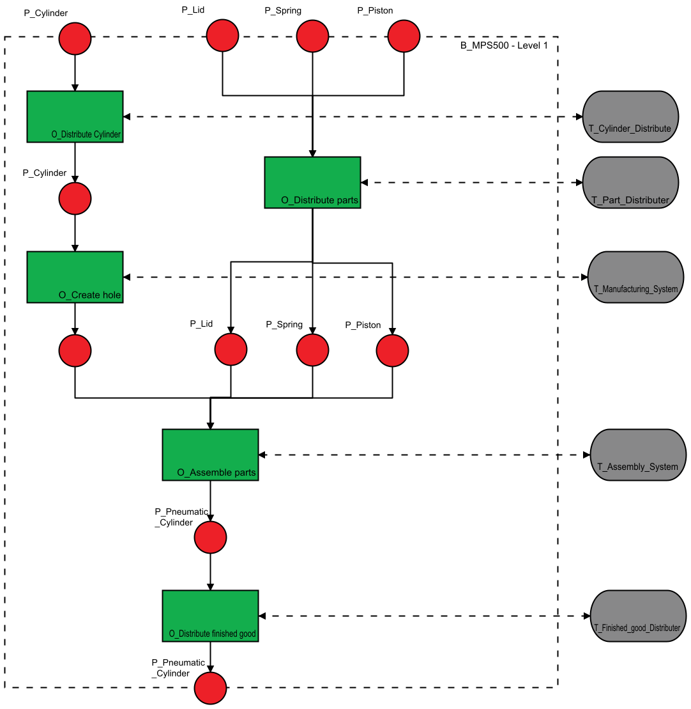
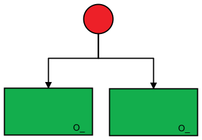
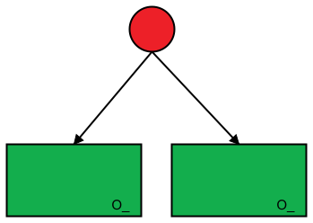
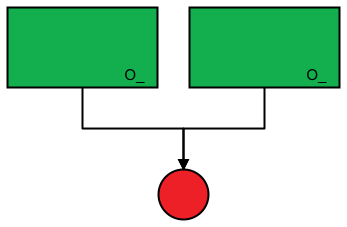
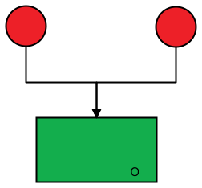
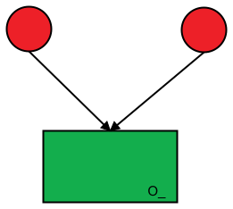
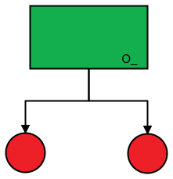
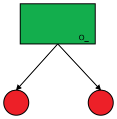

# VDI 3682 - Formalisierte Prozessbeschreibungen

Die Richtlinie stellt ein Vorgehensmodell vor, mit dessen Hilfe Prozesse universell grafisch beschrieben und informationstechnisch erfasst werden können. Während aller Phasen (Planung, Realisierung, Inbetriebsetzung, Wartung, etc.) des Engineerings wird dadurch ein eindeutiges, gewerkeübergreifendes Prozessverständnis erreicht.

Im ersten Teil der Richtlinie wird eine einfache Symbolik, sowie zulässige Beziehungen zwischen diesen eingeführt.

| |
|:--:|
| *Symbole der grafischen Prozessbeschreibung* |

Zustandsbeschreibende Symbole (Produkt, Information, Energie) sind dabei mittels gerichteter Kanten (Flüssen) mit Prozessoperatoren verbunden, die einen Zustand ante in einen Zustand post überführen. Die Zustandsumwandlung geschieht dabei durch die Verwendung von technischen Ressourcen. In der grafischen Notation ist diese Beziehung durch einen gestrichelten Doppelpfeil (Nutzung) dargestellt. Ein gestrichelter Rahmen definiert die Systemgrenze des dargstellten Prozesses.

|  |
|:--:|
| *Beispielprozess: Herstellung eines Pneumatik-Zylinders (aus [1])* |

Durch Dekomposition der Prozessoperatoren lassen sich detailliertere Beschreibungen der Prozessschritte ableiten und der gesamte Prozess strukturieren:

|  |
|:--:|
| *Dekomponierte Prozessansicht des Prozessoperators (aus [1])* |

Die Darstellung von alternativen und parallelen Prozessabläufen wird von der Richtlinie wie folgt vorgesehen:

| Parallel   |      Alternativ      |  Beschreibung |
|:----------:|:-------------:|------|
|  |  | Parallele / Alternative Prozessschritte mit einem zugeführten Produkt |
| |  | Parallele / Alternative Prozessschritte mit einem entstehenden Produkt |
|  |  | Parallel / Alternativ zugeführte Produkte in einen Prozessschritt |
|   |  | Parallel / Alternativ entsehende Produkte aus einem Prozessschritt |

## Literatur

[1] Fay, A., Hoang, X. L., Diedrich, C., Dubovy, M., Eck, C., Hildebrandt, C., Scholz, A., Schröder, T. u. Wiegand, R.: Abschlussbericht – SemAnz40. Vorhandene Standards als semantische Basis für die Anwendung von Industrie 4.0. Hamburg: Helmut-Schmidt-Universität / Universität der Bundeswehr Hamburg 2018
